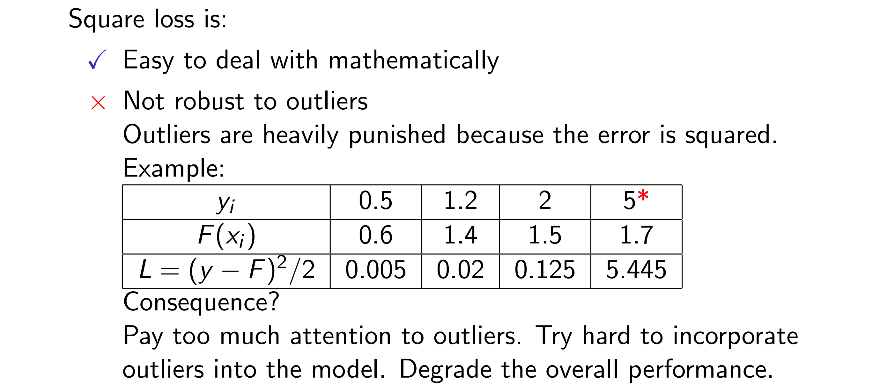
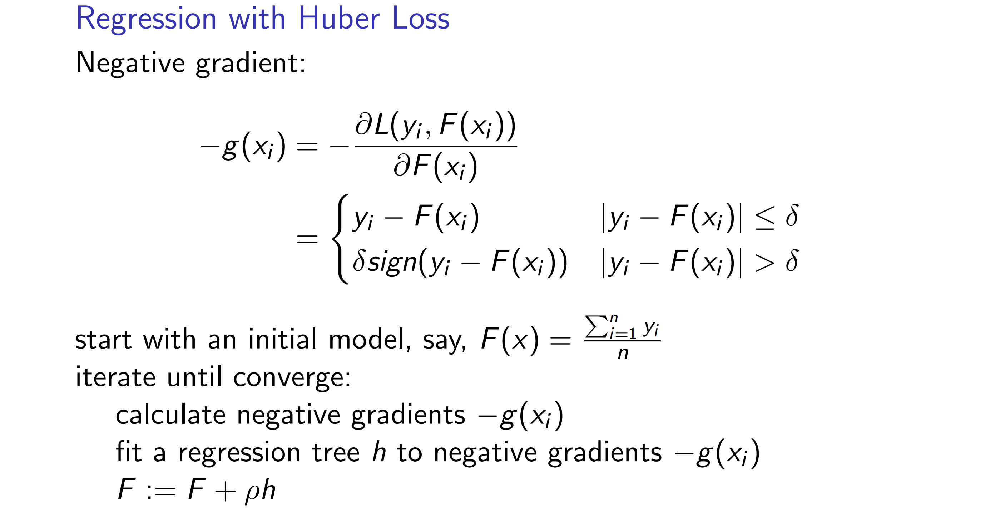

创建于 2022-09-10 
关键词: Gradient Boosting.

## Gradient Boosting

## Outline of the Tutorial

## What is Gradient Boosting

## A Brief History of Gradient Boosting

## Gradient Boosting for Regression

<big>Figure: <b>Gradient Descent.</b></big>

<b>Source:</b> <a href="http://en.wikipedia.org/wiki/Gradient_descent">http://en.wikipedia.org/wiki/Gradient_descent</a>

## Gradient Boosting for Classification

<b>Data Set: <a href="http://archive.ics.uci.edu/ml/datasets/Letter+Recognition">http://archive.ics.uci.edu/ml/datasets/Letter+Recognition</a></b>

<b>Gradient Boosting for Regression: Review</b>

## References

