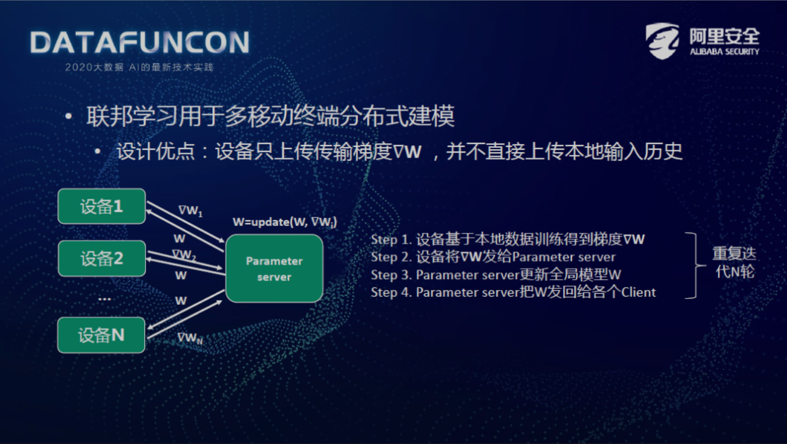
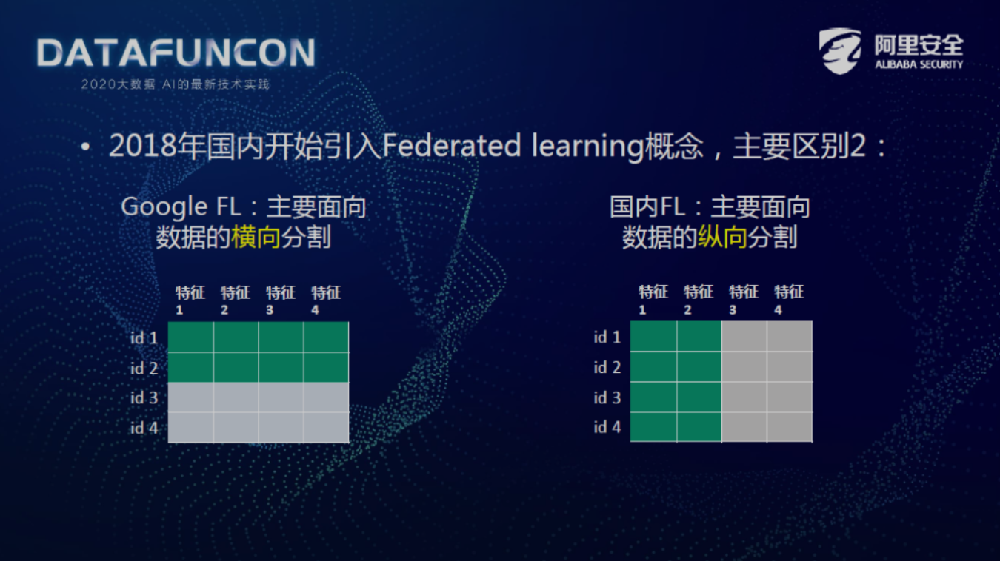

创建于 2022-09-08 
关键词: 联邦学习, 安全多方计算.

本文整理自阿里巴巴高级安全专家洪澄博士的[演讲内容](https://mp.weixin.qq.com/s/ZJM8njX6l397hCSjlEFrgA)，分享时间大概在2020年10月份左右。

**导读：**联邦学习和安全多方计算是当前跨机构数据协同的两类主流技术，本文将从基本思想、安全性、性能等多个方面介绍二者的区别，并介绍阿里在安全多方计算方面的最新成果。

## 联邦学习的发展历史

**1. 联邦学习起源**

联邦学习在2016年由谷歌提出，因为 Google 有安卓系统，需要解决多个安卓设备的分布式建模问题。其中，主要是针对输入法的建模，比如客户在安卓输入法中输入单词 "what"，或许他可能想继续输入 "do you think"，Google 输入法如果能自动联想出来，用户体验就会变得更好，但是自动联想功能需要大量的用户数据才能学习出来，怎么获得这些用户数据呢？

一个比较粗暴的做法是用户输入了什么字就把这个字全部收集到云端上，但这种做法无疑是对用户隐私的一种破坏。由于谷歌崇尚不作恶，怎样在不收集用户输入文字的前提下，预测出用户接下来需要输入的文字？由此，产生了联邦学习。

**2. 联邦学习用于多移动端分布式建模**

联邦学习的设计优点就是用户数据尽量不离开用户自己的安卓设备，用户尽量在本地完成一部分的训练，然后把训练的梯度传到谷歌的云端，这样谷歌只看见一个梯度，它并没有获得这个用户的设备历史聊天内容，这样在设计上有一种 [Privacy by Design](https://gdpr-info.eu/issues/privacy-by-design/#:~:text=The%20term%20%E2%80%9CPrivacy%20by%20Design,in%20the%20technology%20when%20created.) 的设计优点。有很多这样的安卓设备，比如：Parameter server 设备是谷歌的云端服务器，它开始会有一个全局的初始化模型，云端服务器会把模型推到各个设备上，然后各个设备基于本地的数据来优化模型，得到一个更新的梯度，把这个更新的梯度发给服务器，服务器收到这么多梯度之后，会更新全局模型，然后发到这些设备上，这些设备又迭代，直到这个模型在某种程度上收敛为止，这就是联邦学习最开始的一个雏形。

**3. 国内联邦学习与谷歌联邦学习的区别**

**区别一：**

大概在2018年左右，国内开始引入联邦学习概念，与谷歌的联邦学习相比有了一些发展和改变。两者主要的区别是谷歌的联邦学习主要是面向海量移动设备的数据之间的合作，但是国内主要是机构之间的合作，被称为 cross silo FL，一般都是两个或者三个机构之间的合作。但是，目前的应用主要以信贷或者广告为主，例如：两个或多个机构一起判断用户的信用，从而决定要不要借钱给他，或者要不要给他推一些广告。这种情况下参与方的数目跟 Google 的联邦学习相比有很大的降低。

**区别二：**

Google 有很多的设备，每个设备上都有自洽的一些样本，也就是说数据在多个参与方之间是横向分割的，比如说这个绿色的在一个设备上，这个白色的在另一个设备上就是横向的分割，每个都有一个完整的样本。

但是国内经常使用的联邦学习，主要是面向数据的纵向分割的。以信贷为例，其通常都是针对一个人的不同特征并把它们组合起来做联邦学习。比如说特征1与特征2在一个机构，特征3与特征4以及 label 在另外一个机构，也就是说它主要是面向数据的纵向分割。当然横向分割这种应用国内同样存在，但是用的比较多的或者说比较赚钱的，还是在这种纵向的分割法上。

## 联邦学习面临的安全挑战

谷歌原版的联邦学习有什么样的安全挑战？而在国内，会面临什么样的新的安全挑战?

**1. 谷歌原版的联邦学习的安全挑战**

首先是原版横向跨设备的联邦学习。因为它设计上只传梯度，梯度本质是一个函数，它是根据初始的模型以及本地的数据算出来的一个函数，那么这个函数可能是跟原数据是相关的，不能说有梯度就算不出原数据了，那多大程度上相关呢？其实算出来是有一定的难度，但是有一些学者也能算出来，比如说假设我们训练的模型是一个简单模型，比如逻辑回归，我们有了一堆梯度跟原始数据的这种关系，可以通过解方程组把这个未知数解出来的，这是我们在 NIPS 联邦学习 workshop 上的一个工作。如果这个模型比较复杂，解方程组就变得不现实了。

这时有一些其他的方法，比如我们用 machine learning 的优化方法来反向的优化求得一个近似的解，可能求不到精确的结果，但可以取到一个大致差不多的结果，这里有一个去年的 NIPS 的文章，它可以反向的从梯度求出人脸，然后这个人脸可能只有若干个像素的区别。所以我们看到如果不保护这个梯度的话，本质上还是能推出原始数据的。

**谷歌的解决方法：**

**① 加差分隐私**

Google 应对的方法，主要通过加差分隐私，也就是说 Client 上传到云端的梯度，不是直接上传，而是加一个 noise ，但是准确率会下降。准确率的下降，对于 Google 输入法其实是可以接受的，因为输入法的 Top3 顺序换了一下，或者推荐的东西错了一点，用户体验差别不大，但是用在广告或者信贷场景下，准确率差1%就可能差很多很多钱，所以对我们来说加差分隐私不是一种能够接受的方案。

**② Secure Aggregation**

Google 还有一种方案叫做 Secure Aggregation ，也就是说要通过 Secure 的方法把这些梯度聚合在一起，最后效果就是 Server 只看到了n个梯度聚合在一起的结果。但是，不知道某个具体的 Client 梯度是多少，从而导致了 Server 要攻击某个 Client 的概率非常低，但是我们观察到 Secure Aggregation 只适用于 Client 数目比较多的情况。我们可以假设只有两个 Client，那么这个 aggregate 的结果就是两个梯度的和，通过第一个 Client 可以推出第二个的梯度，所以参与方至少要三个人以上，而且这些参与方之间还不能够合谋，所以说这是 Secure Aggregation 的局限性。

**2. 联邦学习应用面临的新安全挑战**

**① 参与方过少带来的问题**

我们经常遇到 cross silo FL 参与方很多情况下都是两个，由于参与方过少会引来新的安全问题。

我们传的梯度是可以用半同态对它进行加密的，例如：Alice 把它的梯度用半同态加密，然后传给 Bob，这样是没问题的。Alice 的参数确实是对 Bob 保密的，但是 Bob 在这个加密的数据上运算完之后他是需要传回给 Alice ，Alice 最终需要解密，或者说每一个 round 都需要解密，每一个 round 中 Bob 的参数实际上是被 Alice 知道的。因为参与方只有两个，Alice 得到两个人的计算结果，她肯定是可以从这中间推断出 Bob 的信息的。也就是说，在这种同态加密保护梯度中，只有一方是受益的，另一方他其实没有受益，跟普通的联邦学习是一样的。就是说半同态加密参数只能实现单向的防护。

**② 纵向FL带来的问题**

- 怎样对齐样本？

纵向的联邦学习又带来了一个新的问题——怎么对齐样本？不管是用不安全的方法还是安全的方法，无论怎么对齐，都是要按照主键对齐的。在对齐之后，不可避免的泄露了一个信息——“对齐的用户都是谁，没对齐的用户呢”， 我们是可以用 PSI 这种方法来保护它的。一旦建模，就不可避免的要把这些数据提取出来，也就是说只要在交集里面的那些用户，就会不可避免的泄露了，我们可以再往里面加入假数据等等，但毕竟它在里面就是在里面了。比如说 A 公司跟 B 公司合作，他们之间想进行一个聚合，可能 A  公司的用户并不想把我是A的注册用户这个信息告诉 B ，也就是说对齐这个东西它其实是在一个灰色地带，所以严格来说如果要对齐的话，应该用户显式的点击同意，我同意  A 把我的信息授权给 B ，所以纵向的样本对齐问题是一个老大难的问题，虽然现在可能大家都在做，但如果监管严格了，这个问题，我们需要一起来想怎么处理。

- 无标签方怎么做特征工程？

纵向的联邦学习肯定有一方是无标签方，无标签方也需要做特征工程，他不能直接把数据传给别人或者直接进行联邦学习，有些特征工程是需要用到标签的，怎么用呢？这也是一个难题。

实际上特征工程本身就是一个特定的算法，跟 Google 的横向联邦学习已经没有关系了，我们需要定制一种方案，比如说我们要算 WOE 。那我们就要定制一个方案来安全地算 WOE ，这也是第二个难题，也就是说纵向的联邦学习带来了很多新的我们以前传统的联邦学习没有遇到过的问题。

上图是 WOE 的例子，WOE 它是要计算特征的重要性，比如说我想把年龄分成不同年龄段，比如 0~18 岁等这样几个年龄段，每个年龄段段内都存在正样本数与负样本数。这个 WOE 就是把反例总占比比上正例总占比，然后求一个 log ，这个数越大，说明这个特征的这个分段对这个模型越重要，也就是它的判别度越高，我们最后就可以给它加一些分。但是，对绿色的参与方来说，他是不知道那个标签的（假设标签是在另一方），那他怎么知道这正样本数跟负样本数呢，所以他是没办法知道的。

所以，怎么计算 WOE 这也是纵向联邦带来的新难题。

## 安全多方计算解决方案

**1. 安全多方计算**

什么是安全多方计算？怎么用它来解决这些难题？

安全多方计算(Secure Multiparty Computation, MPC)是一个密码学的定义，它是可证明安全的，也就是说它有一个严格的安全定义，双方想计算什么东西，除了这个计算的结果之外，中间的任何步骤都是不泄露任何数据内容的。

比如说两个人分别拥有数据 $a$ 和 $b$， 想一起算个 $F\left(a, b\right)$，双方只会获得 $F\left(a, b\right)$，除此之外双方都不会获得对方的其他任何信息。当然这里面有细分，比如说有 Semi-Honest model 跟 Malicious model，这个就是具体技术问题，就不细讲了。

**2. 举例子说明安全多方计算到底怎么做？**

比如说 Alice 跟 Bob，他们分别拥有数据 $a$ 和 $b$，他们想进行一个联合的机器学习 $F\left(a, b\right)$。这里我们先不管它是纵向还是横向，总之 Alice 有一堆数据 $a$，Bob 有一堆数据 $b$ 就对了。安全多方计算 MPC 有很多种，我们这里是用基于秘密共享的例子，就是说用秘密共享的 MPC 方法怎么做这个建模。

首先，Alice 跟 Bob 会把自己的数据进行一个随机拆分，比如 Alice 有一堆数据 $a$，生成了一堆随机数 $r$，$a$ 减去这个随机数，这个 $r$ 是 Alice 本地生成的随机数，同理，Bob 也会本地生成随机数$r'$，这个 $r$ 跟 $r'$ 先不告诉对方，Alice 和 Bob 就都把数据分成了两份，任意一份单拎出来看都是无意义的数字，它们都是随机数，因为一个数减去随机数还是个随机数，然后，他们两个人可以交换一下其中一份数据，比如说 Bob 把这个 $b-r'$ 发给对方，Alice 把这个 $r$ 发给 Bob。然后，我们称这个数据集现在处于一个秘密共享的状态，也就是说单方视角上他们看到的都是乱码，只有双方同意的情况下把这两个数据拼到一起，双方才能知道最终的数据是什么。这个秘密共享状态的数据集的优点就是它是能够计算的。

我们怎么算 $a$ 加 $b$ ？比如 Alice 算出了 $a+b-\left(r+r'\right)$，Bob 算出了 $r+r'$，可以看到这两个东西如果加在一起的话，是可以得到 $a+b$ 的。同理，我们也可以在秘密共享的状态下做 $a*b$、$a/b$，$a>b$ 等等，协议会复杂一点，但是都是能做的。可以用这些运算操作构成整个机器学习算法，比如 Alice 和 Bob 可以共同训练一个机器学习模型 $F\left(a, b\right)$，最终得到 $F\left(a, b\right)$ 的秘密共享状态，Alice 和 Bob 双方都可以获得$F\left(a,b\right)$的最终计算结果，同时任何中间结果都是秘密共享状态的，都是零泄漏的，Alice 和 Bob 都不会知道对方的其他任何信息。

**3. 以 WOE 为例子，怎么安全计算 WOE 呢？**

因为 WOE 就是一个正负样本的比值，假设正负样本我不知道，但是知道标签的那一方可以发一个秘密共享的向量过来。比如，正样本用 $1$ 表示，负样本用 $0$ 表示，有标签的一方把这个向量以秘密共享的方式发过来，我自己的这个向量跟这个秘密共享的向量进行一个乘法，得到一个秘密共享的结果，这个秘密共享的结果就是这个正样本的总数。但是，它是秘密共享状态的，所以我也不知道它是多少。然后，我也可以进行一个秘密共享的除法，也可以再次进行一个秘密共享的 $\log$。最后，如果必要的话，可以把这个数据复原出来，比如算出 WOE 是 $0.9$，这个过程中任何数据都是没有泄露的，除了要计算的 WOE 最终结果。如果我们不用安全多方计算，用其他的自设方法来算 WOE 呢？比如说我们用半同态来算 WOE，有标签的一方把加密的 $0$ 跟 $1$ 发过来，这样会泄露我每个分箱的样本数目，比如我 0~18 岁有 $150$ 个人，这个数据有标签的一方，不可避免的被他知道了，这个泄漏虽然少，但是中间肯定是有泄漏的。安全多方计算的除法跟向量内积还是比较高效的，所以这个方法还是比较好的。

**4. 安全多方计算不需要“数据对齐”就可以建模**

然后来到比较关键的数据对齐方面，虽然有 PSI 的数据对齐，但交集里面的用户身份是不可避免的泄露，不过我们有方法可以在秘密共享的状态下进行匹配。

比如说商家 A 持有用户 1 与用户 2，商家 B 持有用户 2 与用户 3，然后他们可以把他们所有的数据都以秘密共享的形式分成两份。大家有 4 个秘密共享的数据，谁也不知道哪个是谁，然后在这个秘密共享状态下可以进行匹配，得到一个秘密共享的结果。从 4 行得到了 1 行，但是大家只看见了 4 行变成 1 行，谁也不知道这一行是 user2，最后得到了秘密共享状态下的 user2，然后秘密共享状态的数据是可以进行 MPC 建模的。这样完美的保护了用户的隐私，谁也不知道这是 user2，user2 也没有让任何人知道她是 A 的客户还是 B 的客户，那么这样做有什么好处呢？

我们可以下结论说我们这样做是合规的。例如：我们以 GDPR 为例子，其第 5 条规定：对个人数据的处理不应当违反最初收集该数据时的初始目的，意思就是：用户让你干什么你就可以干什么，用户没答应干什么你就不能干什么。严格来说对齐数据的处理这个过程，用户是没有同意商家 A 把我是你的注册用户这个信息告诉商家 B 的，所以，这个过程 somehow 是存在风险的。但是 GDPR 也规定，统计用途是可以超出这个初始目的，很明显建模是一个统计性的。比如，他在这个交集上建出一个模型，这个肯定是一个统计性的模型，也就是我们可以说秘密共享状态下的数据对齐是合规的，这是安全多方计算的一个优势。

具体的算法比较密码学，大家可以参考一下 Facebook 最近发的一个 blog，上面的方法就是在秘密共享状态下进行数据对齐，这是安全多方计算解决的第二个数据挑战，即怎么对齐数据。

**5. 安全多方计算的缺点**

安全多方计算有什么缺点呢？它的缺点就是它性能肯定是低于联邦学习的，为什么这么说？

因为联邦学习中每个 round 总有一部分是可以本地算的，不需要网络，然后算完之后再交互一次。但是安全多方计算，他每一个操作都需要交互，例如：每一个乘法，每一个比较都需要双方的交互，也就是说它的性能可能是比较弱的。但是，目前在 Logistic Regression 这种简单模型下，它的性能经过我们的优化已经是完全可接受了。比如说万级样本百级特征可以 10 秒钟跑完，我们去年参加了一个 iDASH 的安全多方计算比赛，他的题目是：有三个医院，每个医院有一些病人的数据，他们规定这个病人的数据是严格不能够传给别的医院的，他们三个医院想合作在这个数据上进行一个建模，也就是说判断某些基因的人可能或不可能得某些病，这样数据越多建模是越准确的。但是，由于合规问题，医院之间不能互传数据，所以比赛要求要使用安全多方计算来实现医院之间的联合建模。

我们取得了这个比赛的冠军，我们是唯一一个准确率超过 70% 的队伍，我们的性能也非常好，是 20 秒，这也是这个比赛 6 年以来第一次有中国队获得冠军。

总的来说，安全多方计算在某些场景是完全可用的，但是我们不能否认它对复杂模型，比如说 XGBoost 等等，多方安全计算的性能还是存在明显的瓶颈，这方面 Secure Boost 的性能就会比它强很多。

## 总结

我们国内流行的联邦学习方案与 Google 最初发明的联邦学习方案之间存在很大的不同：

技术角度来讲，国内的联邦学习主要类似于 cross silo 的这种联邦学习，它是纵向的，Google 的联邦学习主要是横向的，国内联邦学习主要是面向少量的两个或三个机构的合作，Google 联邦学习面向海量的安卓终端之间的合作。

这个变化肯定带来了新的安全挑战，当我们要面对这些安全挑战时，我们设计上必须慎之又慎，我们要设计完善的解决方案。如果我们为了性能进行了妥协，这是无可厚非的，但是我们一定要详细的对参与方说明，我们这个算法解决方案是解决了什么样的安全问题？提供了何种安全保障？比如说对谁可能会产生何种信息泄露，能抵抗何种攻击，让用户有这样一种知情权。

安全多方计算解决方案，它有其独到的安全优势，因为中间没有信息泄露，它有更广阔的应用前景。我们也很高兴看到 FATE 现在已经提出了SPDZ 的安全多方计算 protocol，我们相信它可以进行更好的后面的迭代开发。

这是我们阿里安全双子座实验室，这个平台的 logo 叫可用不可见，就是 BLINDFOLDED COMPUTING，闭着眼睛计算，并看不到数据的内容。

**今天的分享就到这里，谢谢大家。**
