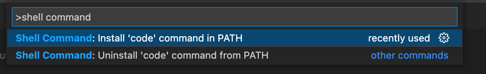

创建于 2022-09-04<br>
关键词: vscode, Mac, brew.

## 安装vscode

```sh
brew install --cask visual-studio-code
```

Done.

参考链接：https://formulae.brew.sh/cask/visual-studio-code

如果报以下错误可能是ARM芯片或Intel芯片比较老，那还是去官网下载安装包安装吧。

```sh
Cask 'visual-studio-code' definition is invalid: invalid 'sha256' value: {:arm=>"241231574896d7b90f9f232619fc1217f1214526d33c50d80885da92675795ab", :intel=>"be088fb98c2841ac71bef427f13a890dbb1552b5e1bd888665898129e2582fb5"}
```

## 配置code命令

如果vscode是用`brew install`安装的则默认应该会安装`code`命令，可以按如下方法快速打开工程项目：

```sh
cd your_project_dir
code .
```

如果vscode不是`brew insrtall`安装的，很可能没有安装`code`命令，可以按照如下方式安装`code`命令：

- 打开**vscode**窗口；

- 按下**Command+Shift+P**打开**Command Palette**；

- 输入**shell command**，选择下面的**Install 'code' command in PATH**；

- 安装成功后就可以使用`code .`快速启动工程项目了。

  

Done.

## 关于code命令的报错

目前遇到的`code .`命令报错及解决方式如下：

- `python:command not found.`
- `/usr/local/bin/code: line 10: //MacOS/Electron: No such file or directory`

解决方案：

```sh
vim ~/.zshrc
alias code='/Applications/Visual\ Studio\ Code.app/Contents/Resources/app/bin/code'
source ~/.zshrc

vim /Applications/Visual\ Studio\ Code.app/Contents/Resources/app/bin/code

## 修改 python 为 python3, 改完如下

function realpath() { python3 -c "import os,sys; print(os.path.realpath(sys.argv[1]))" "$0"; }
CONTENTS="$(dirname "$(dirname "$(dirname "$(dirname "$(realpath "$0")")")")")"
ELECTRON="$CONTENTS/MacOS/Electron"
CLI="$CONTENTS/Resources/app/out/cli.js"
ELECTRON_RUN_AS_NODE=1 "$ELECTRON" "$CLI" --ms-enable-electron-run-as-node "$@"
exit $?
```

Done.

